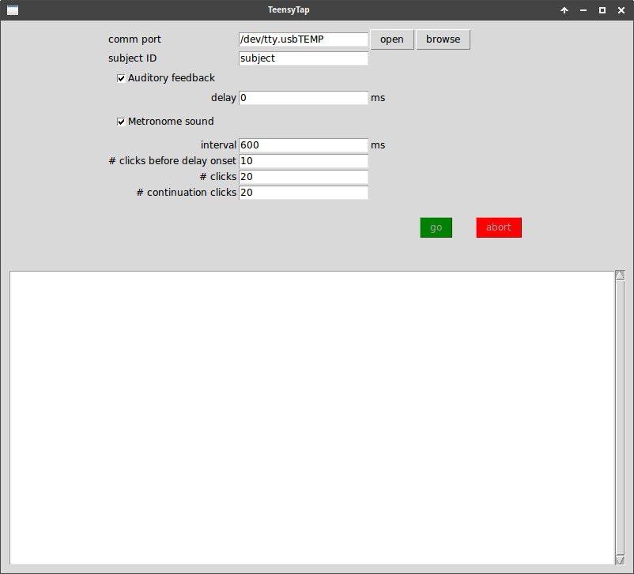
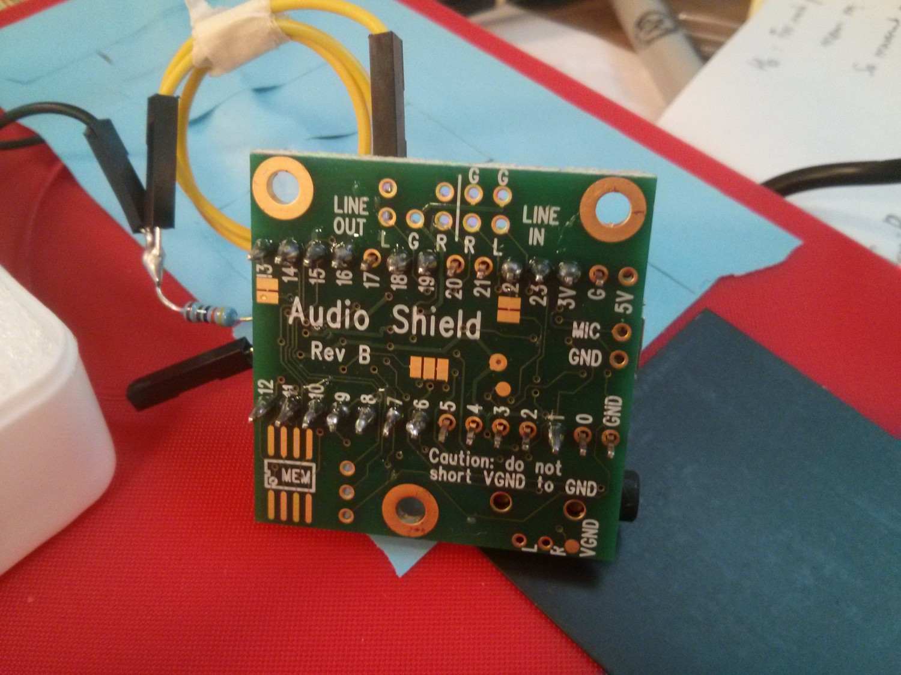
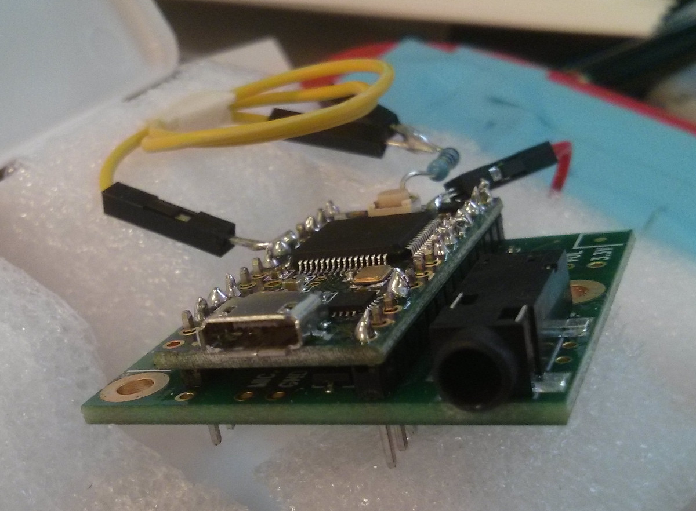
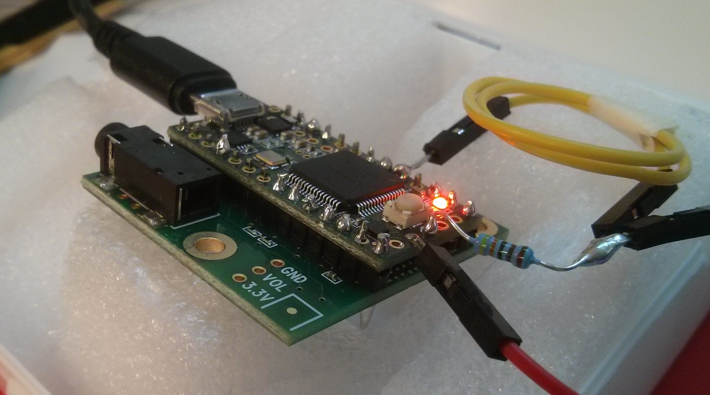

# Teensy Tap

A framework for running sensorimotor synchronisation experiment. The framework is based on Teensy and the Audio Adapter, which are inexpensive and readily available for purchase at many retailers internationally. The code provided here will allow the Teensy to record finger tapping and deliver auditory feedback over headphones, optionally with a pre-specified delay, and simultaneously present metronome click sounds. Data is communicated to the computer via USB for offline analysis.

[Demonstration video](https://vimeo.com/236833791)


## Requirements

### Hardware
* [Teensy 3.2](https://www.pjrc.com/store/teensy32.html) (may also work with later versions)
* [Audio Adapter](https://www.pjrc.com/store/teensy3_audio.html) for Teensy
* FSR sensor (Force-sensitive resistor)
* Break-away straight headers (to connect Teensy with the Audio Adapter)
* A few wires and a resistor
* Tools: soldering iron and tin

### Software
* Python 3
* `pyserial` module (use `pip install pyserial`)

### Development software
The following software is required only once for uploading the code to Teensy. From then on you can use it on any computer that fulfills the above software requirements.
* Arduino IDE
* Teensyduino extension for Arduino IDE


## Usage

### Building the circuit
Refer to the circuit diagram `wiring.svg` included here.

1. Solder the Teensy and the Audio Board together. You have to solder only the pins marked in the wiring diagram (to save time).

2. Solder the wires to the resistor and FSR as indicated in `wiring.svg`. 

That's it!


### Uploading the Teensy code
You can either open the `teensytap/teensytap.ino` script in the Arduino IDE and then upload it from there (see the Teensyduino documentation for how this works). Or, if you have a good build environment, you can simply run:

```
make upload
```

### Running
Run the GUI script:

`python3 gui.py`

You will then see the graphical interface which you use as follows.

1. First select the comm port to connect to the Teensy. This depends on your system and your setup.

2. Click `Open` button to initiate communication with the Teensy.

3. Enter the subject ID. The data of any trial that you start will be saved in a file in the folder `data/SUBJECT/`, where `SUBJECT` is the subject ID you enter in this field.

4. Set your desired trial settings. You can enable or disable auditory feedback by clicking the check box and introduce a delay between the tap and the feeedback. You can include or not a metronome click sound and specify its interval. 

5. Once you have made all your settings, click `Go`. This will communicate your trial settings to the Teensy and once that is completed, the trial will start immediately.




## Close-ups








