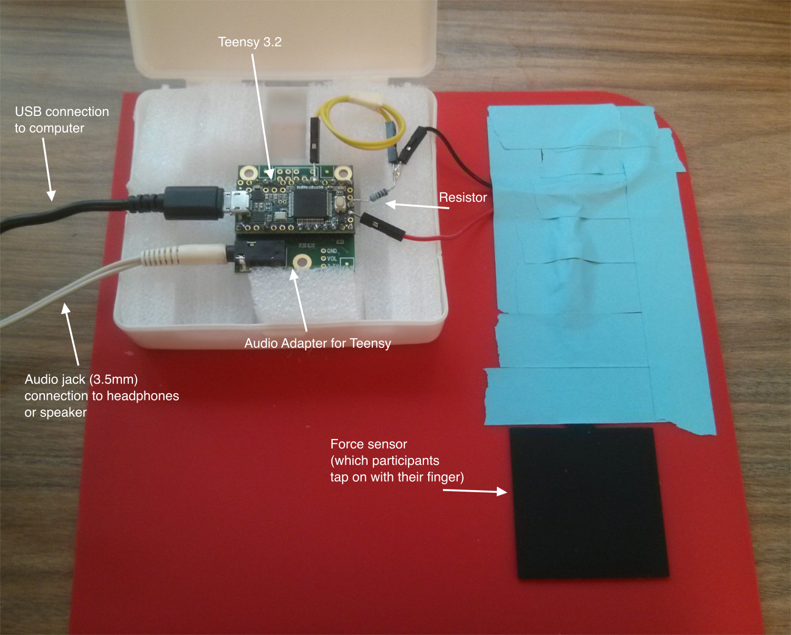

# Teensy Tap

A framework for running sensorimotor synchronisation experiment. The framework is based on Teensy and the Audio Adapter, which are inexpensive and readily available for purchase at many retailers internationally. The code provided here will allow the Teensy to record finger tapping and deliver auditory feedback over headphones, optionally with a pre-specified delay, and simultaneously present metronome click sounds. Data is communicated to the computer via USB for offline analysis.

[See the demonstration video!](https://youtu.be/WwA4infAf5g)



## Requirements

### Hardware
* [Teensy 3.2](https://www.pjrc.com/store/teensy32.html) (may also work with later versions)
* [Audio Adapter](https://www.pjrc.com/store/teensy3_audio.html) for Teensy
* FSR sensor (Force-sensitive resistor)
* Break-away straight headers (to connect Teensy with the Audio Adapter)
* A few wires and a resistor
* Tools: soldering iron and tin

### Software
* Python 3 (also works with Python 2)
* `pyserial` module (use `pip install pyserial`)

### Development software
The following software is required only once for uploading the code to Teensy.
From then on you can use it on any computer that fulfills the above software requirements.

* [Arduino IDE](https://www.arduino.cc/en/Main/Software)
* [Teensyduino extension for Arduino IDE](https://www.pjrc.com/teensy/teensyduino.html). Teensyduino is basically a set of tools that allow you to use the Arduino development environment to make code for your Teensy.


## Usage

### Building the circuit
Refer to the circuit diagram `wiring.svg` included here.

1. Solder the Teensy and the Audio Board together. You have to solder only the pins marked in the wiring diagram (to save time).

2. Solder the wires to the resistor and FSR as indicated in `wiring.svg`. 

That's it!


### Installation (needs to be done only once)

See the [installation video](https://youtu.be/wIUFWRm3EA0).

1. Download the [Arduino IDE](https://www.arduino.cc/en/Main/Software) - **important** make sure you download version **1.8.9** (Teensyduino only works with some specific versions of Arduino IDE).

2. Download [Teensyduino](https://www.pjrc.com/teensy/td_download.html) and run the installer, pointing it to where you have installed the Arduino code. If you're under Linux, make sure you download the udev rules as indicated on the site above.

3. Download or clone this repository (i.e. `git clone http://github.com/florisvanvugt/teensytap`).

4. Install pyserial. The best way is to use pip, e.e. `sudo pip install pyserial`.

5. Tell TeensyTap where you have installed the Arduino code. To do this, edit the file `Makefile` with any text editor and change the line starting with `ARDUINO :=` to point to wherever you have installed the arduino IDE.

4. Upload the Teensy code. Two options to do this: (a) Run `make upload` (this requires that you have `make` installed, which you can do under Ubuntu with `sudo apt install build-essential`). Alternatively (b) open the `teensytap/teensytap.ino` script in the Arduino IDE and then upload it from there (see the Teensyduino documentation for how this works). If you take this latter step instead of using `make`, you will need to rename the file `teensytap/DeviceID_custom.h` to `teensytap/DeviceID.h`.


### Running
Run the GUI script:

`python3 gui.py` (or simply `make gui`)

You will then see the graphical interface which you use as follows.

1. First select the comm port to connect to the Teensy. This depends on your system and your setup.

2. Click `Open` button to initiate communication with the Teensy.

3. Enter the subject ID. The data of any trial that you start will be saved in a file in the folder `data/SUBJECT/`, where `SUBJECT` is the subject ID you enter in this field.

4. Set your desired trial settings. You can enable or disable auditory feedback by clicking the check box and introduce a delay between the tap and the feeedback. You can include or not a metronome click sound and specify its interval. 

5. Once you have made all your settings, click `Go`. This will communicate your trial settings to the Teensy and once that is completed, the trial will start immediately.


## Close-ups


## Sub-millisecond timing resolution

By default, the timing resolution of sounds on the Teensy is approximately 3 ms. If that's not enough for you and you want sub-millisecond timing, please do the following.

This is also shown in a [video](https://youtu.be/DVS2NKvLXm0).

Go to where you have installed the Arduino IDE. In that directory, open the file `/hardware/teensy/avr/cores/teensy3/AudioStream.h` in a text editor.

Change the line
```
#define AUDIO_BLOCK_SAMPLES  128
```

to 
```
#define AUDIO_BLOCK_SAMPLES  32
```

(Note that `AUDIO_BLOCK_SAMPLES` is defined in various lines depending on the processor used -- for Teensy 3.2 it's `MK20DX128` which means you should edit the first occurrence of `AUDIO_BLOCK_SAMPLES` ).

That's it! Recompile the code and you should be good to go.


# TODO

- [ ] Check baudrate -- see how long the serial writes take (this may disrupt the functionality)
